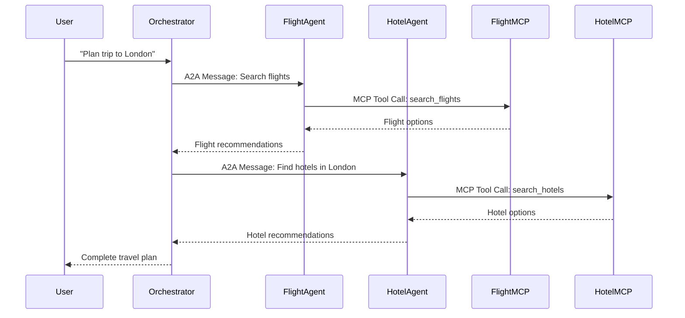

# Travel AI Application

A comprehensive multi-agent travel planning system built with Spring AI, java 25 Virtual Threads, and Model Context Protocol (MCP) servers. The application demonstrates agent-to-agent (A2A) communication for coordinated flight and hotel booking.

## Architecture

The system consists of several microservices that work together:

```
┌─────────────────┐    ┌───────────────────┐    ┌─────────────────┐
│  Flight Agent   │◄──►│Travel Orchestrator│◄──►│  Hotel Agent    │
│   (Port 8080)   │    │   (Port 9000)     │    │   (Port 8082)   │
└─────┬───────────┘    └───────────────────┘    └─────┬───────────┘
      │                                               │
      ▼                                               ▼
┌─────────────────┐                             ┌─────────────────┐
│ Flight MCP      │                             │ Hotel MCP       │
│ Server          │                             │ Server          │
│ (Port 8081)     │                             │ (Port 8083)     │
└─────┬───────────┘                             └─────┬───────────┘
      │                                               │
      ▼                                               ▼
┌─────────────────┐                             ┌─────────────────┐
│ Flight Providers│                             │ Hotel Providers │
│ • Joyair        │                             │ • Marriott      │
│ • AeroGo        │                             │ • Holiday Inn   │
│ • DracAir       │                             │ • Accor         │
└─────────────────┘                             └─────────────────┘
```

## Key Features

- **Multi-Agent Architecture**: Flight and Hotel agents that specialize in their domains
- **A2A Communication**: Agents communicate using the Agent-to-Agent protocol
- **MCP Integration**: Model Context Protocol servers for each domain
- **Multiple Providers**: Each MCP server aggregates multiple service providers
- **Spring AI Integration**: Uses OpenAI GPT-4 for intelligent conversation handling
- **Virtual Threads**: java 25 virtual threads for efficient concurrent processing

## Technology Stack

- **java 25** with Virtual Threads
- **Spring Boot 3.3.0**
- **Spring AI 1.0.1 https://spring.io/blog/2025/08/08/spring-ai-1**
- **A2A Java SDK 0.2.5 https://github.com/a2aproject/a2a-java**
- **OpenAI GPT-4**
- **H2 Database** (for development)
- **Maven** (multi-module project)

## Project Structure

```
travel-ai-application/
├── travel-ai-core/           # Shared models and utilities
├── flight-agent/             # Flight-specialized AI agent
├── hotel-agent/              # Hotel-specialized AI agent
├── mcp-flight-server/        # Flight MCP server with providers
├── mcp-hotel-server/         # Hotel MCP server with providers
├── travel-orchestrator/      # Main orchestration service
└── pom.xml                   # Root Maven configuration
```

## Quick Start

### Prerequisites

1. **java 25** or later
2. **Maven 3.6+**
3. **OpenAI API Key**

### Setup

1. **Clone the repository**:
   ```bash
   git clone https://github.com/hhovhann/TravelAiApplication.git
   cd TravelAiApplication
   ```

2. **Set your OpenAI API Key**:
   ```bash
   export OPENAI_API_KEY=your_openai_api_key_here
   ```

3. **Build the project**:
   ```bash
   mvn clean install
   ```

### Running the Application

Start each service in separate terminals:

1. **Start MCP Flight Server**:
   ```bash
   cd mcp-flight-server
   mvn spring-boot:run
   ```
   Server will start on http://localhost:8081

2. **Start MCP Hotel Server**:
   ```bash
   cd mcp-hotel-server
   mvn spring-boot:run
   ```
   Server will start on http://localhost:8083

3. **Start Flight Agent**:
   ```bash
   cd flight-agent
   mvn spring-boot:run
   ```
   Agent will start on http://localhost:8080

4. **Start Hotel Agent**:
   ```bash
   cd hotel-agent
   mvn spring-boot:run
   ```
   Agent will start on http://localhost:8082

5. **Start Travel Orchestrator**:
   ```bash
   cd travel-orchestrator
   mvn spring-boot:run
   ```
   Main application will start on http://localhost:9000

### Using Docker (Alternative)

```bash
# Build all services
docker-compose build

# Start all services
docker-compose up
```

## API Usage

### Plan a Trip

```bash
curl -X POST http://localhost:9000/api/travel/plan \
  -H "Content-Type: application/json" \
  -d '{
    "from": "New York",
    "to": "London",
    "departureDate": "2024-12-15",
    "returnDate": "2024-12-22",
    "passengers": 2,
    "preferences": "business class, luxury hotel near city center"
  }'
```

### Chat with Travel AI

```bash
curl -X POST http://localhost:9000/api/travel/chat \
  -H "Content-Type: application/json" \
  -d '{
    "message": "I need to find flights from NYC to Paris for next month"
  }'
```

### Check Agent Status

```bash
curl http://localhost:9000/api/travel/agents/status
```

## How It Works

1. **User Request**: The Travel Orchestrator receives user requests
2. **Intent Analysis**: Spring AI analyzes the request to determine which agents to involve
3. **Agent Coordination**: The orchestrator communicates with Flight and Hotel agents using A2A protocol
4. **MCP Integration**: Each agent calls its respective MCP server for data
5. **Provider Aggregation**: MCP servers aggregate data from multiple providers (Joyair, AeroGo, DracAir for flights; Marriott, Holiday Inn, Accor for hotels)
6. **Response Synthesis**: The orchestrator combines agent responses into a comprehensive travel plan

## Agent Communication Flow



## Configuration

### Environment Variables

- `OPENAI_API_KEY`: Your OpenAI API key (required)
- `FLIGHT_MCP_URL`: Flight MCP server URL (default: http://localhost:8081)
- `HOTEL_MCP_URL`: Hotel MCP server URL (default: http://localhost:8083)

### Application Properties

Each service has its own `application.yml` with specific configurations for ports, database connections, and AI model settings.

## Development

### Adding New Providers

1. **For Flight Providers**: Implement `FlightProvider` interface in `mcp-flight-server`
2. **For Hotel Providers**: Implement `HotelProvider` interface in `mcp-hotel-server`
3. **Register as Spring Component**: Use `@Component` annotation

### Adding New Agent Capabilities

1. Extend agent skills in the A2A agent card definition
2. Implement corresponding MCP tools
3. Update agent processing logic

## Testing

```bash
# Run all tests
mvn test

# Run specific module tests
cd flight-agent
mvn test
```

## Monitoring

- **H2 Console**: Available for each MCP server for database inspection
- **Application Logs**: Configured for DEBUG level during development
- **Agent Status**: Check via `/api/travel/agents/status` endpoint

## Contributing

1. Fork the repository
2. Create a feature branch
3. Make your changes
4. Add tests
5. Submit a pull request

## License

This project is licensed under the MIT License - see the LICENSE file for details.

## Troubleshooting

### Common Issues

1. **OpenAI API Key**: Ensure your API key is set correctly
2. **Port Conflicts**: Check that all required ports (8080-8083, 9000) are available
3. **A2A SDK**: The A2A SDK is not yet in Maven Central - build it locally if needed

### Getting Help

- Check the logs for detailed error messages
- Verify all services are running on their expected ports
- Ensure network connectivity between services
